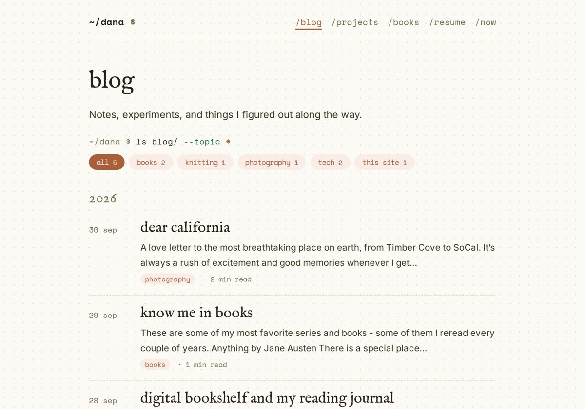

# /blog: topic filters and writing posts from the site (PRD)

Status: **proposal, not built.** v2, Oct 1 2026: Dana's answers folded in; scope now includes signing in and writing/editing posts from the site. Mockups in `docs/prd-blog-tags/` come from working prototypes of the real pages.

## 1. Why

- **Readers** should be able to see only the posts about what they came for (books, knitting, photos, tech).
- **Dana** should be able to write a new post, fix an old one, or change a post's topics from the site itself, signed in the same way as on /books, without opening the repo. Saved changes show up on the site by themselves.

## Part A: topic filters

### A1. What it looks like

Under the "Notes, experiments…" line on /blog, a terminal line and a row of topic pills:

```
~/dana $ ls blog/ --topic *
( all 5 ) ( books 2 ) ( knitting 1 ) ( photography 1 ) ( tech 2 ) ( this site 1 )
```

- **The prompt line** reads like a command and follows the filter: `--topic *` for everything, `--topic books`, `--topic "this site"`.
- **Pills** use the existing topic pill style, with the post count in a muted color. The selected pill is filled terra. "all" first, then topics **A–Z** (approved).
- **The list** keeps its year grouping; posts that don't match are hidden, and a year heading disappears when none of its posts match.
- **Each post card** shows all of its topics as pills; clicking one filters by it.
- **On a post page**, the topic pill links to `/blog/?tag=<topic>`.

| Day (books) | Evening (tech) | Retro (books) |
|---|---|---|
|  |  |  |

Unfiltered:  Phone: 

### A2. Behavior

1. **Default is "all"**: every post is listed when /blog opens (approved).
2. **One topic at a time.** Clicking a pill selects it; "all" (or the selected pill again) clears it.
3. **Shareable URL**: `?tag=books` (spaces as `-`), written with `history.replaceState`. An unknown tag shows everything.
4. **No JavaScript**: no pill row, every post listed, as today.
5. **Accessibility**: pills are `<button aria-pressed>`; a hidden live region says "2 notes about books".
6. **Motion**: a 150 ms fade, none with reduced motion. With typing sounds on, a pill click thocks and the `--topic` word re-types.
7. **The home page doesn't change** (approved).

### A3. Data

- Posts get **`topics:`**, a list (`topics: [books, tech]`). A single `topic:` keeps working. The first topic is the "main" one.
- The pill row is built from all posts at build time; a new topic appears the first time a post uses it.
- **Tagging (approved):**

| Post | Topics |
|---|---|
| digital bookshelf and my reading journal | books, tech |
| planting this garden | this site, tech |
| dear california | photography |
| know me in books | books |
| on knitting your first (bad) sweater | knitting |

## Part B: signing in and writing posts

### B1. What it looks like

**Signed in**, /blog shows a small line above the title, `signed in as dana · + new post · sign out`, and an **edit** link next to every post title. Visitors see none of it. A "sign in" link sits at the bottom of /blog, like /books.


**The editor** (`/blog/edit/`, and `/blog/edit/?post=<slug>` for an existing post) uses the site's own type and colors:

- **title** in the serif, **date**, and **topics** as the same pills (click to turn on/off, `+ new topic` to add one).
- **the post** in Markdown, with a **write / preview** switch; the preview uses the site's real post styles.
- **publish** (filled) and **save as draft**. After saving, the status line reads like a commit: `~/dana $ git commit -m "<title>" · saved · live in about a minute`.

| Day | Evening | Retro | Phone |
|---|---|---|---|
|  |  |  |  |

(The post text in the editor mockups is sample text.)

### B2. How saving works

The site is static (GitHub Pages), so a post only changes when its Markdown file in the repo changes. Saving therefore **commits the file to `main`** and the existing deploy publishes it, about a minute later.

```
editor (danaadylova.com) → notes API on Railway (/site/posts, signed-in only) → GitHub API: commit src/posts/<slug>.md → deploy.yml → live
```

- **New endpoints** on the existing API (`app/site_posts.py`, next to `site_comments.py`): `GET /site/posts` (list), `GET /site/posts/{slug}` (front matter + body + the file's version), `PUT /site/posts/{slug}` (create or update), all behind the same author session as /books.
- **GitHub access**: a fine-grained token limited to **this repo, Contents: read & write**, stored on Railway as `GITHUB_TOKEN`. Never in the browser.
- **No overwriting by accident**: each save sends the version it started from; if the file changed in the meantime (say, edited in the repo), the save stops and asks to reload.
- **Drafts**: `draft: true` in front matter; drafts are left out of /blog, the feed and the home page, but listed for Dana when signed in.
- **What it checks**: title required, date valid, topics are lowercase words, the slug (file name, from the title on first save) can't change after publishing, so links never break.
- **Commit messages**: `post: <title> (from the site)`, so the history shows what was edited from the editor.
- **Photo posts and shortcodes** (frame, favorite) are just text in the editor and keep working. Uploading new photos from the editor is **out of scope** (they still go through `scripts/photos.mjs`).

### B3. Signing in: options

| Option | How it feels | What it needs | Notes |
|---|---|---|---|
| **1. Email link** (what /books uses) | type your email, click the link in Gmail | nothing new | Proven, already live. A minute of waiting each time; the session lasts 90 days, so it's rare. |
| **2. Passkey** (Face ID / Touch ID) | one tap on the phone or laptop | a "register this device" step after an email-link sign-in; a small WebAuthn library on the API | Fastest and phishing-proof. Each device is set up once; the email link stays as the fallback. |
| **3. Sign in with GitHub** | one click, if signed in to GitHub | a GitHub OAuth app; only Dana's GitHub account allowed | Fits, since posts live on GitHub. Another secret on Railway. |
| **4. Sign in with Google** | one click with your Gmail | a Google Cloud OAuth client | Familiar; more setup and Google console upkeep for one user. |
| **5. No custom editor: a git-based CMS** (Decap CMS at `/admin`) | a ready-made editor that signs in with GitHub | an OAuth helper service; its own look | Less code to build, but it wouldn't look like the site and adds a dependency. |

**Recommendation:** start with **1** (reuse /books sign-in, so it works on day one) and add **2, passkeys**, as the quick everyday sign-in. 3 is a good alternative to 2 if you'd rather click "Sign in with GitHub".

The /books sign-in returns to /books; it gains a `next` so signing in on /blog lands back on /blog (or the editor).

### B4. Security

- Only `AUTHOR_EMAIL` can sign in (as today); every `/site/posts` call checks the author session (HttpOnly, SameSite cookie) and the request origin.
- The GitHub token can only touch this one repo's files, and only lives on Railway.
- Rate limit on saves; every save is a normal commit, so anything can be undone from the repo history.

## Out of scope (for now)

- A search box; per-topic pages and feeds; filters on /projects.
- Deleting posts from the editor (a draft hides a post; deleting stays a repo action).
- Uploading photos from the editor.

## Open questions

1. **"this site" topic**: it's the topic on *planting this garden* (the post about building this website). Keep it as its own topic, or call that post just **tech**?
2. **Sign-in**: email link only, or email link + passkeys (recommended), or GitHub?
3. **Publishing straight to `main`** from the editor is the point of the feature, but it is the one place that skips "Dana asks for merges". OK?

## Build plan (after sign-off)

1. Part A (topic filters): `blog.njk`, a `topics` filter in `eleventy.config.js`, `src/js/blog.js`, styles in `garden.css`, topic pills linked from posts, `topics:` on posts. Ships alone.
2. Part B: `app/site_posts.py` + tests on the API; `GITHUB_TOKEN` on Railway (Dana creates the token); `/blog/edit/` page and `src/js/editor.js`; signed-in bits on /blog; drafts in the build. Then passkeys if chosen.
3. CLAUDE.md in both repos.
