# /blog: topic filters and writing posts from the site (PRD)

Status: **Parts A and B built on branches (not live):** site `feat/blog-tags`, API `feat/blog-editor`. v3, Oct 1 2026: all of Dana's answers folded in, drafts added (B3). Mockups in `docs/prd-blog-tags/` come from working prototypes of the real pages.

## 1. Why

- **Readers** should be able to see only the posts about what they came for (books, knitting, photos, tech).
- **Dana** should be able to write a new post, fix an old one, or change a post's topics from the site itself, signed in the same way as on /books, without opening the repo. Saved changes show up on the site by themselves.

## Part A: topic filters

### A1. What it looks like

Under the "Notes, experiments…" line on /blog, a terminal line and a row of topic pills:

```
~/dana $ ls blog/ --topic *
( all 5 ) ( books 2 ) ( knitting 1 ) ( photography 1 ) ( tech 2 )
```

- **The prompt line** reads like a command and follows the filter: `--topic *` for everything, `--topic books`.
- **Pills** use the existing topic pill style, with the post count in a muted color. The selected pill is filled terra. "all" first, then topics **A–Z** (approved).
- **The list** keeps its year grouping; posts that don't match are hidden, and a year heading disappears when none of its posts match.
- **Each post card** shows all of its topics as pills; clicking one filters by it.
- **On a post page**, the topic pill links to `/blog/?tag=<topic>`.

| Day (books) | Evening (tech) | Retro (books) |
|---|---|---|
| 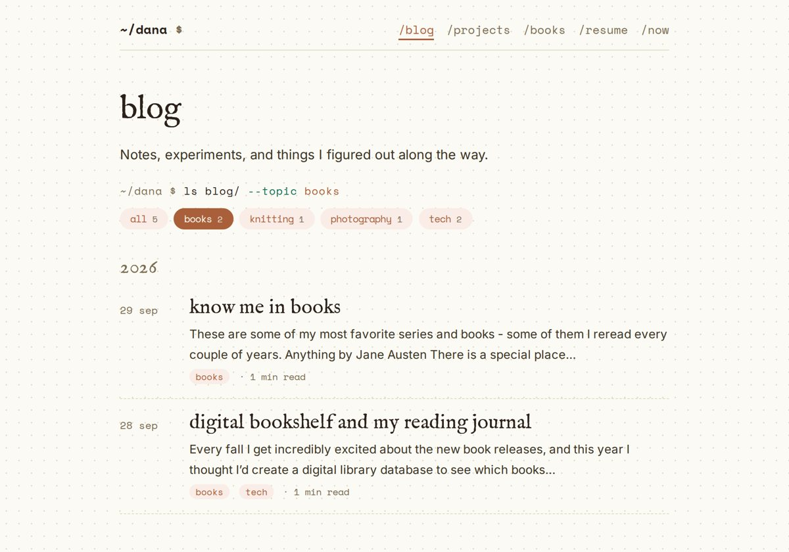 | 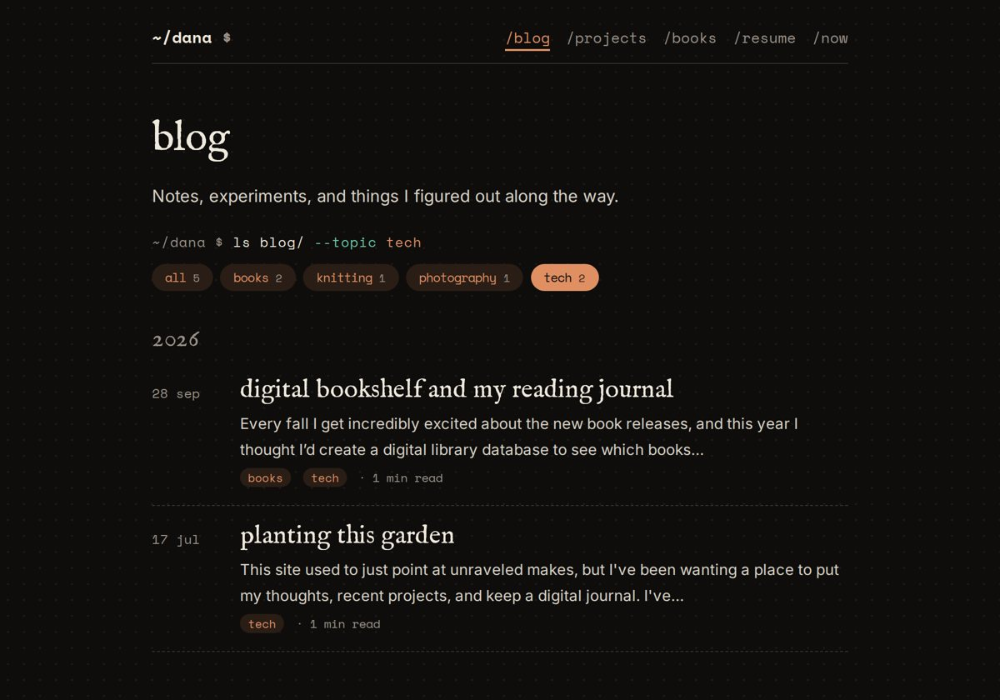 | 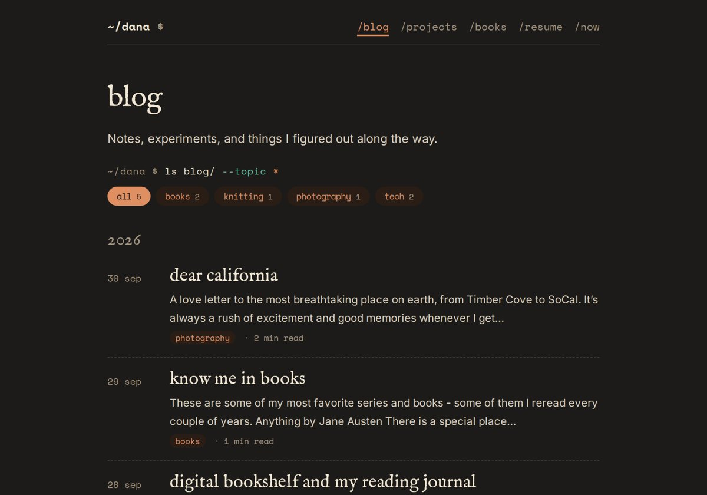 |

Phone (tech): 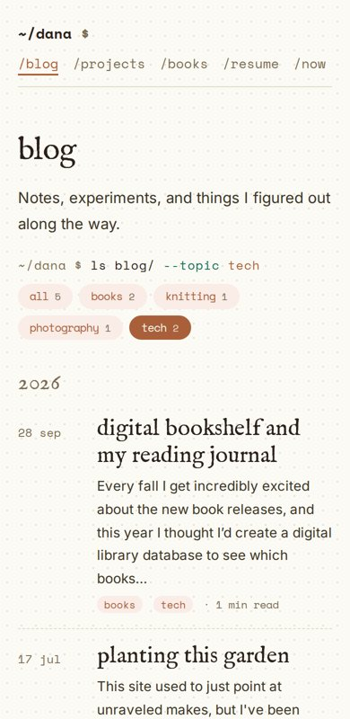

(Screenshots of the built filter.)

### A2. Behavior

1. **Default is "all"**: every post is listed when /blog opens (approved).
2. **One topic at a time.** Clicking a pill selects it; "all" (or the selected pill again) clears it.
3. **Shareable URL**: `?tag=books` (spaces as `-`), written with `history.replaceState`. An unknown tag shows everything.
4. **No JavaScript**: no pill row, every post listed, as today.
5. **Accessibility**: pills are `<button aria-pressed>`; a hidden live region says "2 notes about books".
6. **Motion**: a 150 ms fade, none with reduced motion. With typing sounds on, a pill click thocks and the `--topic` word re-types.
7. **The home page doesn't change** (approved).

### A3. Data

- Posts get **`topics:`**, a list (`topics: [books, tech]`). A single `topic:` keeps working. The first topic is the "main" one.
- The pill row is built from all posts at build time; a new topic appears the first time a post uses it.
- **Tagging (approved):**

| Post | Topics |
|---|---|
| digital bookshelf and my reading journal | books, tech |
| planting this garden | tech (the "this site" topic is retired) |
| dear california | photography |
| know me in books | books |
| on knitting your first (bad) sweater | knitting |

## Part B: signing in and writing posts

### B1. What it looks like

**Signed in**, /blog shows a small line above the title, `signed in as dana · + new post · sign out`, and an **edit** link next to every post title. Visitors see none of it. A "sign in" link sits at the bottom of /blog, like /books.

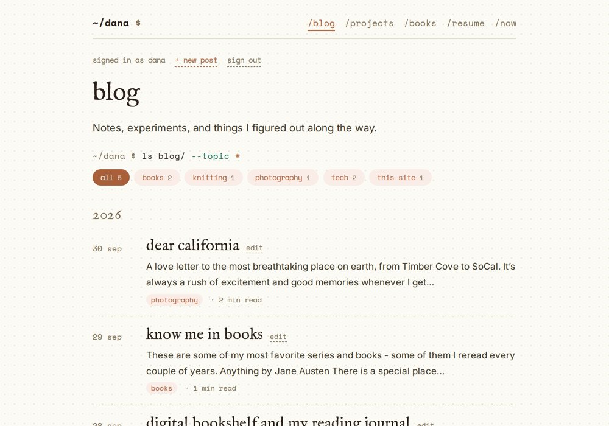

**The editor** (`/blog/edit/`, and `/blog/edit/?post=<slug>` for an existing post) uses the site's own type and colors:

- **title** in the serif, **date**, and **topics** as the same pills (click to turn on/off, `+ new topic` to add one).
- **the post** in Markdown, with a **write / preview** switch; the preview uses the site's real post styles.
- **publish** (filled) and **save as draft**. After saving, the status line reads like a commit: `~/dana $ git commit -m "<title>" · saved · live in about a minute`.

| Day | Evening | Retro | Phone |
|---|---|---|---|
| 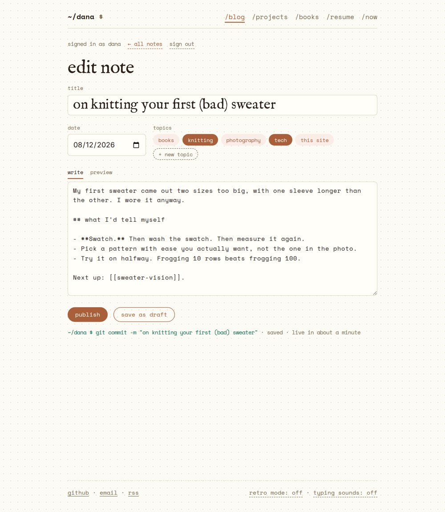 | 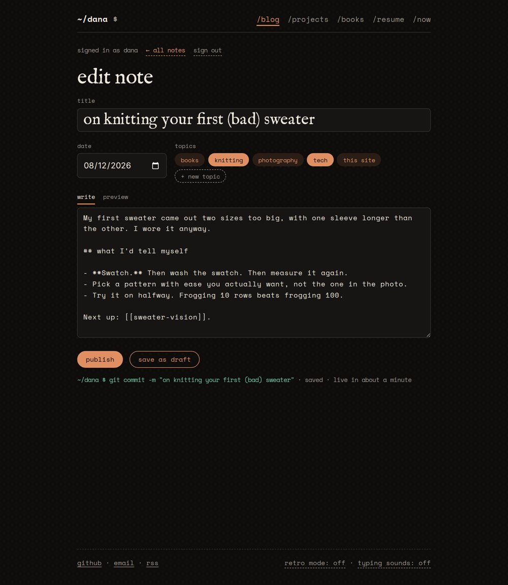 | 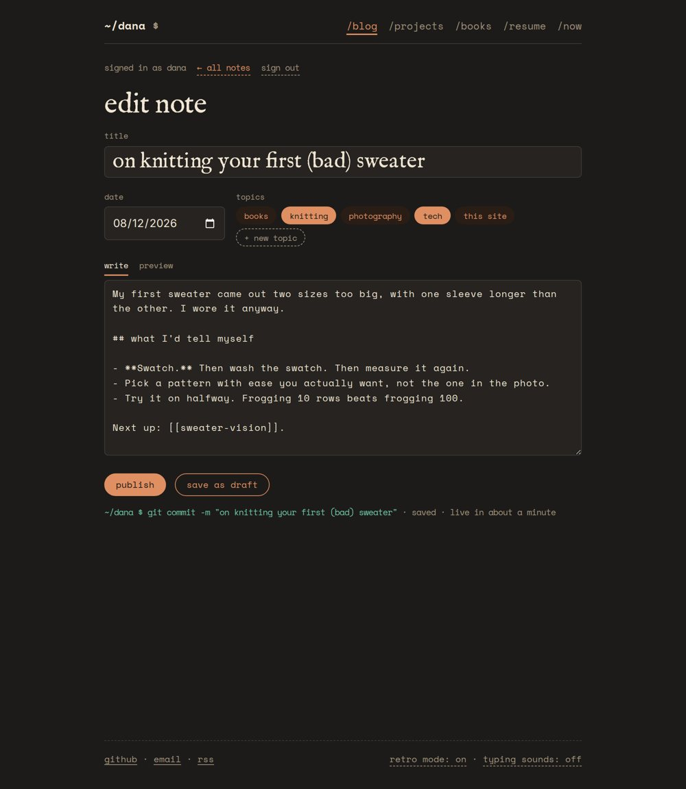 | 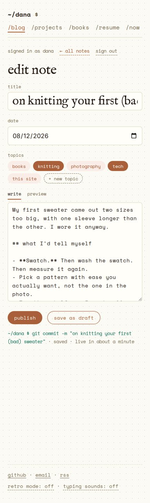 |

(The post text in the editor mockups is sample text.)

### B2. How saving works

The site is static (GitHub Pages), so a post only changes when its Markdown file in the repo changes. Saving therefore **commits the file to `main`** and the existing deploy publishes it, about a minute later.

```
editor (danaadylova.com) → notes API on Railway (/site/posts, signed-in only) → GitHub API: commit src/posts/<slug>.md → deploy.yml → live
```

- **New endpoints** on the existing API (`app/site_posts.py`, next to `site_comments.py`): `GET /site/posts` (list), `GET /site/posts/{slug}` (front matter + body + the file's version), `PUT /site/posts/{slug}` (create or update), all behind the same author session as /books.
- **GitHub access**: a fine-grained token limited to **this repo, Contents: read & write**, stored on Railway as `GITHUB_TOKEN`. Never in the browser.
- **No overwriting by accident**: each save sends the version it started from; if the file changed in the meantime (say, edited in the repo), the save stops and asks to reload.
- **Drafts** never go to GitHub (the repo is public). They are kept privately by the API (B3) and become a file only when published.
- **What it checks**: title required, date valid, topics are lowercase words, the slug (file name, from the title on first save) can't change after publishing, so links never break.
- **Commit messages**: `post: <title> (from the site)`, so the history shows what was edited from the editor.
- **Photo posts and shortcodes** (frame, favorite) are just text in the editor and keep working. Uploading new photos from the editor is **out of scope** (they still go through `scripts/photos.mjs`).

### B3. Drafts

**Where they live.** The site's repo is public, so a draft committed there could be read by anyone. Drafts are kept in the API's own database on Railway (a `blog_drafts` table: title, date, topics, body, which post it belongs to if any, last edited). **Publish** turns a draft into a commit; until then nothing about it is on GitHub or the site.

**Two kinds of draft:**
1. **A new post that isn't published yet.** "save as draft" in the editor.
2. **Changes to a published post that aren't published yet.** "save as draft" while editing a live post: the live post stays as it is, the changes wait.

**What Dana sees when signed in** (visitors see none of it; it's filled in by the page script after it asks the API, so it is never in the static HTML):
- A **drafts** box at the top of /blog, under the topic pills, outlined with a dashed line and marked "only you can see these". Each draft is a normal post card with "draft" where the date goes, its topics, "edited 2 hours ago", and **edit · publish · delete draft**. Newest first. It follows the topic filter like any other card; with no drafts the box isn't shown.
- A published post with waiting changes gets an **unpublished changes** badge next to its title (and its edit link opens the draft, not the live text).
- **Preview**: the editor's preview tab shows the draft with the real post styles. Drafts have no public address.
- **publish** asks once ("publish sweater vision? it'll be live in about a minute"), then commits; the card moves into the list after the next deploy, and the draft is removed.
- **delete draft** asks once, then removes the draft only (a live post is never touched by it).

| Day | Evening | Retro |
|---|---|---|
| 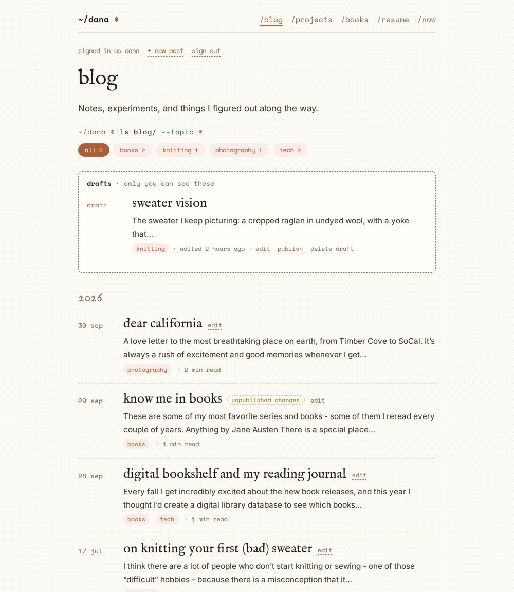 | 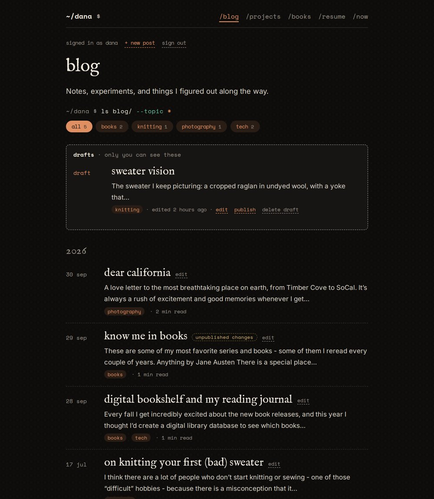 | 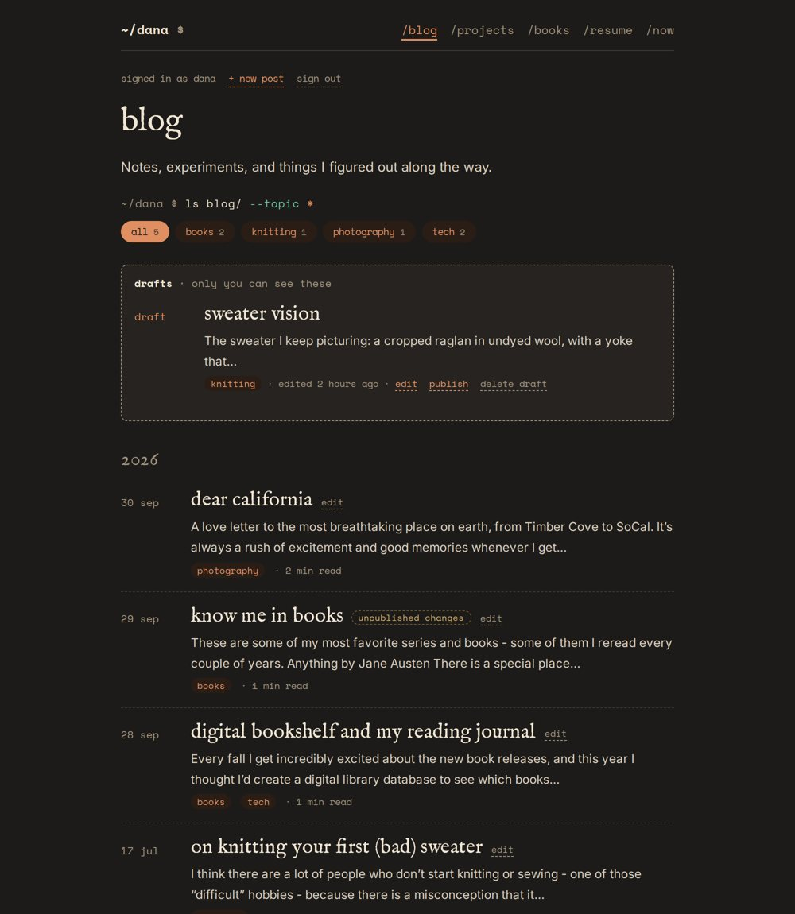 |

(The draft "sweater vision" and the badge on "know me in books" are sample data.)

### B4. Signing in

| Option | How it feels | What it needs | Notes |
|---|---|---|---|
| **1. Email link** (what /books uses) | type your email, click the link in Gmail | nothing new | Proven, already live. A minute of waiting each time; the session lasts 90 days, so it's rare. |
| **2. Passkey** (Face ID / Touch ID) | one tap on the phone or laptop | a "register this device" step after an email-link sign-in; a small WebAuthn library on the API | Fastest and phishing-proof. Each device is set up once; the email link stays as the fallback. |
| **3. Sign in with GitHub** | one click, if signed in to GitHub | a GitHub OAuth app; only Dana's GitHub account allowed | Fits, since posts live on GitHub. Another secret on Railway. |
| **4. Sign in with Google** | one click with your Gmail | a Google Cloud OAuth client | Familiar; more setup and Google console upkeep for one user. |
| **5. No custom editor: a git-based CMS** (Decap CMS at `/admin`) | a ready-made editor that signs in with GitHub | an OAuth helper service; its own look | Less code to build, but it wouldn't look like the site and adds a dependency. |

**Decision: 1, the same email link as /books, and one sign-in for both.** The session cookie belongs to the API (not to a page), so signing in on /books also signs you in on /blog and the reverse; signing out of one signs out of both. The sign-in link gains a `next` so it lands back where you started (/books, /blog or the editor). A "sign in" link sits at the bottom of /blog like on /books. Passkeys or GitHub can be added later on top.

### B5. Security

- Only `AUTHOR_EMAIL` can sign in (as today); every `/site/posts` call checks the author session (HttpOnly, SameSite cookie) and the request origin.
- The GitHub token can only touch this one repo's files, and only lives on Railway.
- Rate limit on saves; every save is a normal commit, so anything can be undone from the repo history.

## The GitHub key (created Oct 1 2026)

Publishing from the editor uses a GitHub key that only the server knows. Keep this so it's easy to renew.

| | |
|---|---|
| **What** | A GitHub *fine-grained personal access token* named `danaadylova.com editor` |
| **Created** | Oct 1 2026, on github.com → profile picture → Settings → Developer settings → Personal access tokens → Fine-grained tokens |
| **Expires** | about **Oct 1 2027** (1 year). A week before, make a new one (below). When it expires, **publish** says GitHub didn't accept the change; drafts keep working. |
| **Can do** | Only the repo **danaadylova/danaadylova.github.io**, only **Contents: read and write** (plus GitHub's automatic Metadata: read-only). Nothing else on the account. |
| **Stored** | Railway → the **ravelry-gauge-matcher** service (not Postgres) → Variables → **`GITHUB_TOKEN`**. Not in any repo, not in the browser. |
| **Check it's set** | `https://unraveled.danaadylova.com/site/health` → `"blog_editor": {"github_token": true}` |

**To renew** (or replace it if it ever leaks):
1. GitHub → Settings → Developer settings → Personal access tokens → Fine-grained tokens → **Generate new token**.
2. Name `danaadylova.com editor`, expiration 1 year, resource owner danaadylova, **Only select repositories** → danaadylova/danaadylova.github.io.
3. Permissions → Repository permissions → **Contents: Read and write**. Nothing else.
4. Generate, copy it (it's shown once).
5. Railway → ravelry-gauge-matcher → Variables → edit **`GITHUB_TOKEN`** → paste → save → **Deploy** (Railway holds variable edits until you deploy).
6. Back on GitHub, delete the old token from the same list.

**To turn publishing off** at any time: delete the token on GitHub (or the variable on Railway). The site stays as it is; publish shows an error; nothing else breaks.

## Out of scope (for now)

- A search box; per-topic pages and feeds; filters on /projects.
- Deleting posts from the editor (a draft hides a post; deleting stays a repo action).
- Uploading photos from the editor.

## Decisions (Oct 1 2026)

1. **tech** tagging as in A3; **"this site" is retired**, that post is just tech.
2. Topics **A–Z**; **"all"** by default; the **home page doesn't change**.
3. **Sign-in: the /books email link, shared** between /books and /blog.
4. **publish goes live directly.** Usually site changes wait for Dana's "merge"; with the editor, pressing **publish** is that approval, so the post goes live about a minute later with no extra step. "save as draft" never goes live.

## Build plan (after sign-off)

1. Part A (topic filters): **built** on `feat/blog-tags` (`blog.njk`, `topics` / `mainTopic` / `topicCounts` filters, `src/js/blog.js`, styles in `garden.css`, topic pills on post pages link to `/blog/?tag=…`). Ships alone.
2. Part B (**built**, tested end to end against a stand-in GitHub): `app/site_posts.py` + `blog_drafts` table + 13 tests on the API; `GITHUB_TOKEN` on Railway (Dana creates the token); `next` on sign-in; `/blog/edit/` and `src/js/editor.js`; signed-in bits and drafts on /blog.
3. CLAUDE.md in both repos.
